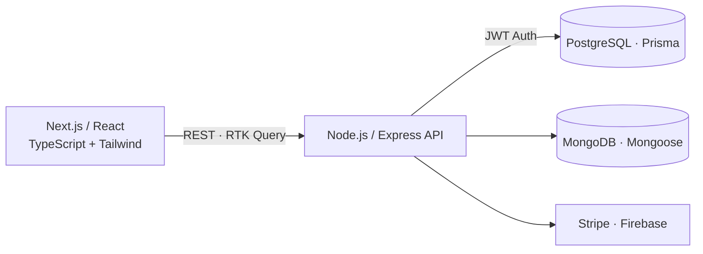

<!-- HEADER -->

 

  

---

## 👨‍💻 About Me

I'm a **Full Stack Developer** who builds modern, scalable, and maintainable web applications. My core is the **JavaScript/TypeScript ecosystem**, spanning frontend, backend, APIs, databases, authentication, and application architecture.

<table>
  <tr>
    <td>⚛️ Modern React & Next.js apps</td>
    <td>🔌 REST API development & integration</td>
  </tr>
  <tr>
    <td>🗄️ Database design & ORM</td>
    <td>🔐 Authentication & authorization</td>
  </tr>
  <tr>
    <td>📊 Admin dashboards & business apps</td>
    <td>📱 Responsive & accessible UI</td>
  </tr>
  <tr>
    <td>♻️ Clean, reusable, maintainable code</td>
    <td>🌿 Git-based workflows</td>
  </tr>
</table>

---

## 🛠️ Tech Stack

**Frontend**

  

React.js · Next.js · TypeScript · JavaScript · Tailwind CSS · Ant Design · Redux Toolkit · RTK Query · Axios

**Backend**

  

Node.js · Express.js · REST APIs · JWT · Authentication · Authorization

**Databases & ORM**

  

MongoDB · Mongoose · PostgreSQL · Prisma ORM

**Tools & Services**

  
  

---

## 🚀 What I Build

| | |
|---|---|
| 🏢 **Business management systems** | 📊 **Admin dashboards** |
| 🛒 **E-commerce platforms** | 🔐 **Authentication systems** |
| 👥 **Customer & member portals** | 🔗 **REST API integrations** |
| 🗃️ **Database-driven applications** | ⚡ **Real-time features** |
| 💳 **Payment integrations** | 📝 **Content & management platforms** |

---

## 🧭 Architecture at a Glance

---

## 📊 GitHub Stats

---

## 🤝 Let's Connect

I'm always open to interesting projects and collaboration. Feel free to reach out!

📫 **[sajibbabu751@gmail.com](mailto:sajibbabu751@gmail.com)**

 

`React` · `Next.js` · `TypeScript` · `Node.js` · `Express` · `MongoDB` · `PostgreSQL`

